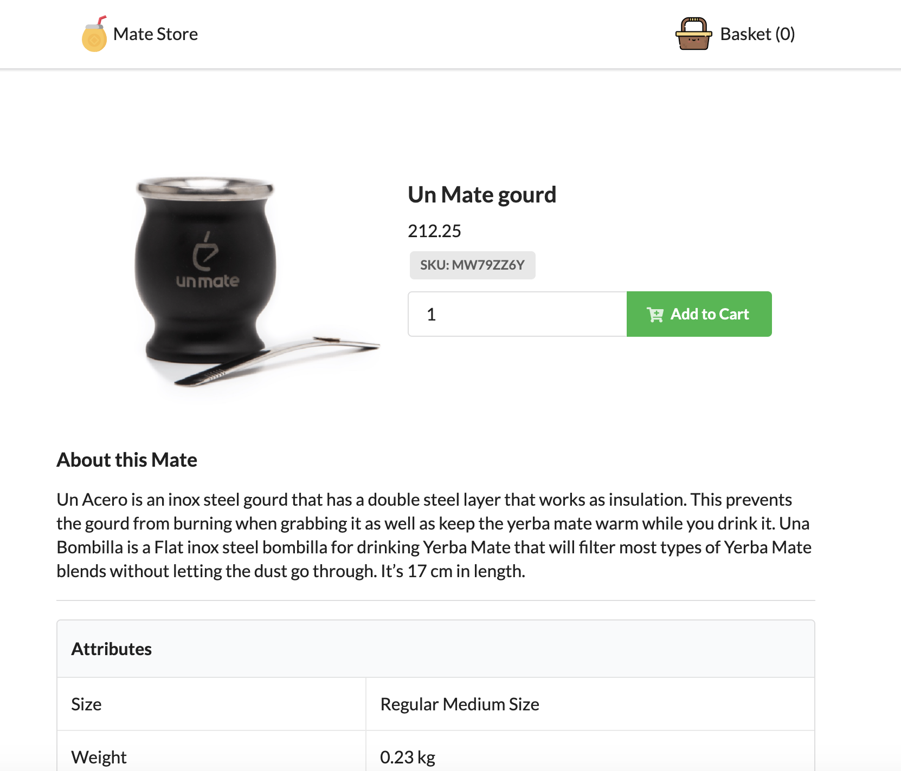

# Mate Store (NextJS / TS)

Product list built in NextJS.




## Tree

```
├── components
│   ├── CartItemList
│   ├── CartSummary
│   ├── Footer
│   ├── IconHeader
│   ├── Layout
│   ├── Navbar
│   ├── ProductList
│   ├── ProductSummary
│   └── SVGIcons
├── database
├── pages
│   ├── about
│   ├── api
│   │   └── mate
│   └── product
├── public
│   └── images
└── store
```

## Description

This app consumes its own API (Next Js API). In order to simulate a more realistic scenario, the API has configured a random delay to resolve the request. You can check more in the database folder.

## Setup the project

1. Install the dependencies: `yarn`
2. Run development: `yarn dev`
3. You will see the project up and running on `http://localhost:3000`
